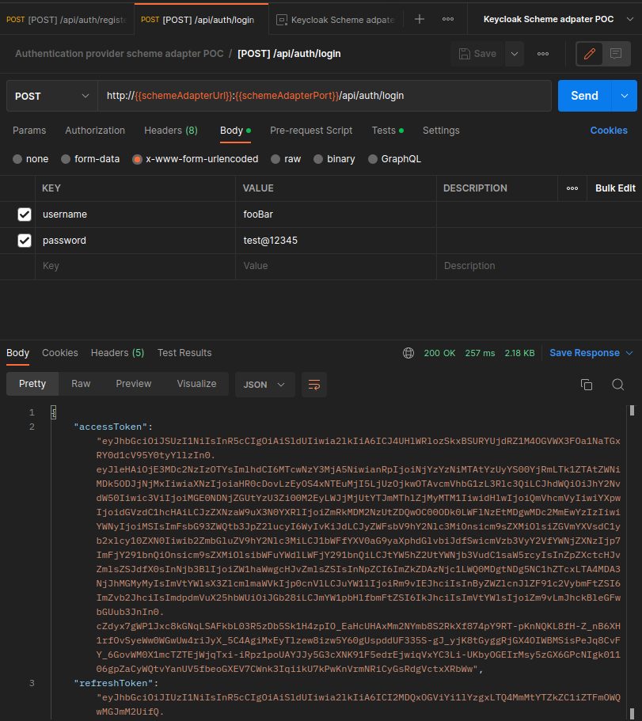

# Keycloak POC basic demo

In this document, we will try to undertake the following steps:

- [x] Keycloak installation.
- [x] Keycloak initial provisioning.
- [x] User registration.
- [x] User sign-in.
- [ ] Protecting an endpoint by authentication.

## 1- Keycloak installation:

In this demo, we used the following [docker-compose.yml](./docker-compose.yml) file to bootstrap a Keycloak service alongside to a persistence unit.

In order to avoid the https requirement to login to the admin console, as a workaround, we made the following:

```bash
docker exec -it keycloak-postgre-1 bash # excute bash in interactive mode
psql -U keycloak -p 5432 -d keycloak # connect to the Keycloak DB
update REALM set ssl_required='NONE'; # suppress ssl_required for all realms
```

## 2- Keycloak initial provisioning:

### 2.1- Add a realm:

1. Login to the admin console using the credential defined in the docker-compose file then select "Create Realm".
   
2. Using a resource file or a realm name, keep "Enabled" switch toggled on and select "Create".
   
3. [OPTIONAL] Suppress the SSL requirement by selecting 'None':
   
4. Add capability config to the admin-cli as the following:
   
   you might need to add a Backchannel logout URL in order to save the running configuration.
5. Select Save then select 'Service accounts roles' and add 'manage-users' role from 'Filter by clients'.
   
   you will need to grab the client secret from the 'Credentials' tab.

### 2.2- Add a client

1. Add a new client with the 'Client authentication' capability enabled (in order to prevent unauthorized access by requiring a client secret).
   you will also need to grab the client secret from the 'Credentials' tab.
   
2. Test the setup Keycloak environment using the Postman collection [KeycloakRestAPI.postman_collection.json](./KeycloakRestAPI.postman_collection.json)
   1. Obtain access token from service account for the client cli:
      
   2. Register a user:
      
   3. Log-in the user:
      

## 3- Authentication provider scheme adapter:

In this section, we will show a demo of the use cases that this scheme adapter in this repository covers. We've been using the following Postman collection [AuthProviderSchemeAdapterPOC.postman_collection.json](./AuthProviderSchemeAdapterPOC.postman_collection.json)

###  3.1- User registration:


### 3.2- User login:

